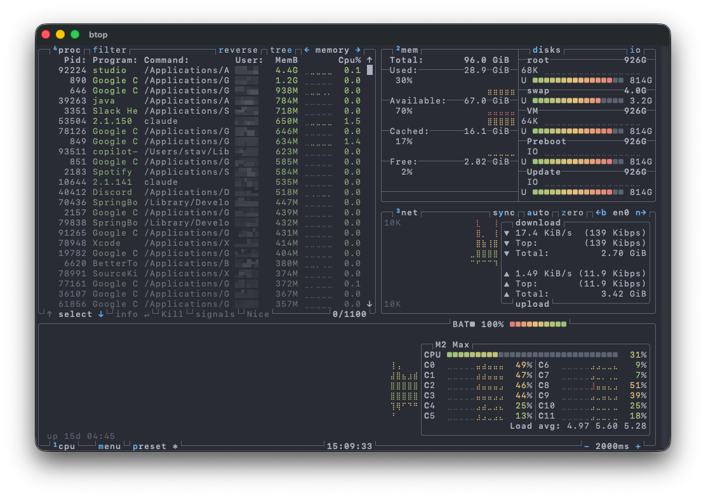

<div align="center">


# btop for macOS

**[btop](https://github.com/aristocratos/btop), running as a real native macOS app.**

<a href="https://github.com/stavfx/btop-mac/releases/latest"></a>


</div>

A thin AppKit wrapper that embeds a terminal ([SwiftTerm](https://github.com/migueldeicaza/SwiftTerm))
and runs btop inside it. Unlike launching btop in iTerm or Terminal, it is its own
application — so the **menu bar, Dock, and ⌘-Tab all read "btop"**, with its own
icon and window.

<div align="center">
  
</div>

## Features

- **Its own app identity** — dedicated icon, Dock entry, and menu bar (no more "iTerm2").
- **Native window** — resizable; the terminal reflows as you drag.
- **Familiar shortcuts** — `⌘Q` quits, `⌘W` closes; relaunching refocuses the window.
- **Tiny & self-contained** — a single lightweight app around your existing btop.

## Requirements

- macOS 13 (Ventura) or later, on **Apple Silicon**
- [btop](https://github.com/aristocratos/btop), installed via Homebrew:

  ```sh
  brew install btop
  ```

## Install

Download the latest **`.dmg`** from the
**[Releases](https://github.com/stavfx/btop-mac/releases/latest)** page, open it,
and drag **btop** into **Applications**. Launch it from Spotlight, Alfred, or the Dock.

> First launch: right-click **btop** → **Open** once. The app is open-source but
> not notarized, so macOS asks for confirmation the first time.

## Build from source

```sh
git clone https://github.com/stavfx/btop-mac.git
cd btop-mac
./build.sh     # compiles dist/btop.app (Xcode Swift toolchain + SwiftTerm)
./install.sh   # installs to ~/Applications and registers with Launch Services
```

The icon is generated by `icon/make-icon.swift`; run `./icon/make-icon.sh` to
rebuild `icon/btop.icns` after changing the design.
